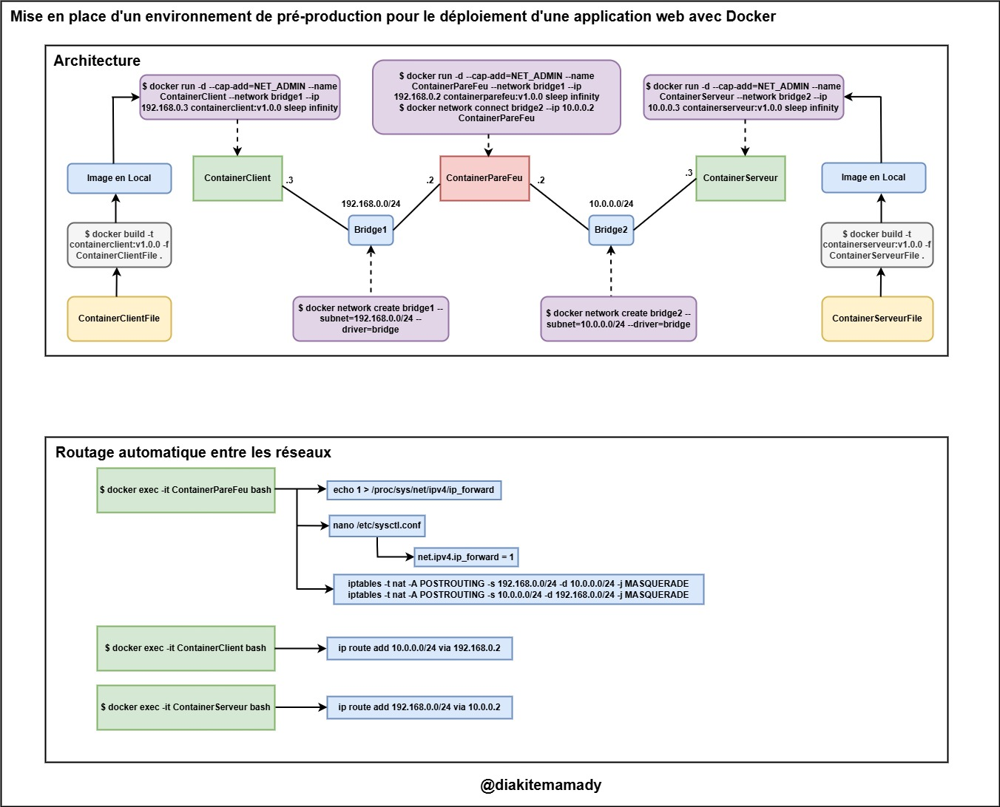

# Mise en place d'un Environnement de Pré-production avec Docker

## Contexte du Projet
Ce projet consiste à créer un environnement de pré-production pour le déploiement d'une application web dans un environnement Docker. L’infrastructure repose sur plusieurs conteneurs Docker connectés via des réseaux ponts (« bridges »), avec un conteneur jouant le rôle de pare-feu pour contrôler la communication entre les réseaux.

---

## Architecture

---

## Auteur
[Diakite Mamady](https://github.com/DMamady)

---

Avec cette configuration, vous disposez d’un environnement de pré-production fonctionnel, isolé et sécurisé, préparé pour tester des applications web avec Docker.
